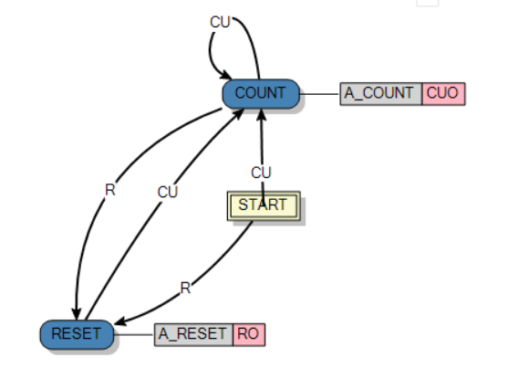
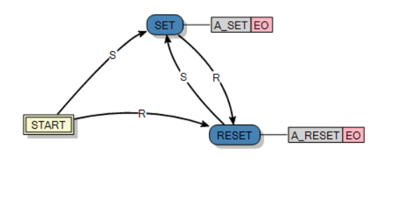
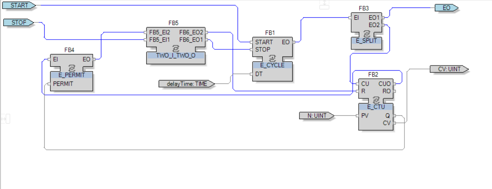
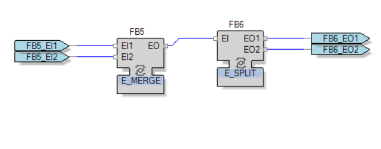
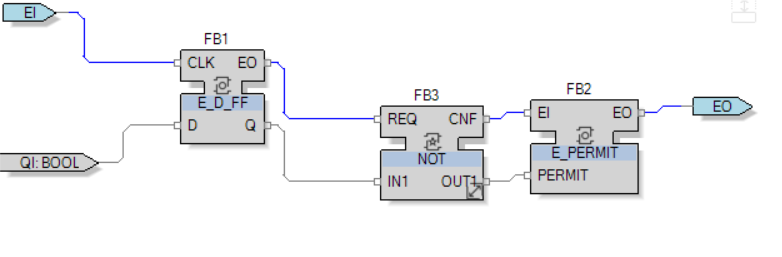

# IEC 61499 Function Blocks Implementation

## 1. Introduction 
The goal of this assignment is to develop skills in creating basic and composite function blocks. The task is to implement functions from IEC 61499 and verify and validate the implemented blocks.

## 2. Basic Function Blocks 
This section describes the purpose, event/data interfaces, Execution Control Charts (ECC), algorithms used, and the observed execution behavior of the implemented Basic Function Blocks.

### 2.1 Increasing Counter (E_CTU)
**Requirements:**
The `E_CTU` block shall set `Q` to TRUE when the predefined value of `CV` is reached. When `Reset` is triggered, the `E_CTU` shall stop counting and trigger the `RO` event. The block must follow this timing diagram:

**Implementation:**
*   **Interface:** 
    *   **Inputs:** 2 input events (`CU` and `R`), and an input `INT` value `PV` associated with the `CU` event. 
    *   **Outputs:** 2 output events (`CUO` and `RO`), and 2 output data variables `Q` (BOOL) and `CV` (INT) both associated with the `CUO` and `RO` events.
*   **Execution Control Chart (ECC):** Consists of 3 states: START, COUNT, and RESET.

    *   **State RESET:** Triggers event `RO` and executes algorithm `A_RESET`. The algorithm sets `Q` to false and `CV` to 0.
    *   **State COUNT:** Triggers event `CUO` and executes `A_COUNT`. The algorithm increases `CV` by 1, sets `CU` back to False, and then checks if `CV` has reached `PV`. If so, `Q` is set to True; else, `Q` is set to False.

**Testing, Verification, and Validation:**
The block can be checked in Debug mode. The block works correctly and exactly as defined in the timing diagram, successfully copying the standard library block behavior.

### 2.2 RS Flip-Flop (E_RS)
**Requirements:**
The library implements `E_RS` and `E_SR` with the same functionality; in this assignment, `E_RS` is implemented.
The `E_RS` block shall set `Q` to TRUE when an event is triggered on the `S` input. `Q` should be reset to 0 when event `R` is triggered. An output event is triggered when the `Q` value is changed. The block must follow this timing diagram:

**Implementation:**
*   **Interface:** 
    *   **Inputs:** 2 input events (`S` and `R`) and no input data. 
    *   **Outputs:** 1 output event (`EO`) and a `BOOL` value `Q` associated with it.
*   **Execution Control Chart (ECC):** Consists of 3 states: START, SET, and RESET.

    *   **State SET:** Triggers event `EO` and executes algorithm `A_SET`. The algorithm sets `Q` to 1.
    *   **State RESET:** Triggers event `EO` and executes algorithm `A_RESET`. The algorithm sets `Q` to 0.

**Testing, Verification, and Validation:**
The block can be checked in Debug mode. It works correctly according to the defined timing diagram and copies the library block behavior.

---

## 3. Composite Function Blocks
This section covers the purpose of the Composite Function Blocks, shows the Function Block network, explains how the Basic and Standard Library Function Blocks work together, and validates the implementation against the supplied specifications.

### 3.1 Event Train (E_TRAIN)
**Requirements:**
After the `START` event is triggered, the `EO` event shall be triggered `N` times every `delayTime` interval. After `N` times triggered `EO` or if a `STOP` event occurs, the block shall stop. The block must follow this timing diagram:

> **Note:** The library-implemented E_Train also requires a STOP event after every START event.

**Implementation:**
*   **Interface:** 
    *   **Inputs:** 2 input events (`START` and `STOP`). Input `UINT` value `N` is associated with the `START` and `STOP` events. Input value `delayTime` (type TIME) is associated with the `START` event.
    *   **Outputs:** Output event `EO`. Output data `CV` (UINT) associated with `EO`.
*   **Function Block Network:**

    *   `E_CYCLE`: Triggers time intervals.
    *   `E_CTU`: Counts how many times `E_CYCLE` triggers an output.
    *   `E_PERMIT`: Triggers stop and reset when the `N` value is reached.
    *   `TWO_I_TWO_O`: A composite block consisting of `E_MERGE` and `E_SPLIT` to make a block with two input and output events.

**Testing, Verification, and Validation:**
We can check the block in the Application using the Watch function and running a simulation of the network. The block works correctly according to the defined time diagram.

### 3.2 Boolean Falling Edge (E_F_TRIGGER)
**Requirements:**
`EO` is triggered when a transition of `QI` from TRUE to FALSE is detected. If `QI` does not change, or changes from FALSE to TRUE, no `EO` is fired. The block must follow this timing diagram:

**Implementation:**
*   **Interface:** 
    *   **Inputs:** Input event `EI` and a `BOOL` data `QI` associated with this event. 
    *   **Outputs:** Output event `EO` and no output variables.
*   **Function Block Network:**

    *   `E_D_FF`: Reacts to the changing of `QI`.
    *   `E_PERMIT`: With `NOT`, it triggers `EO` when the D flip-flop is detected on a LOW state.

**Testing, Verification, and Validation:**
Checked in the Application using the Watch function and running a simulation of the network. The block works correctly as defined in the time diagram and successfully copies the behavior of the library block.
